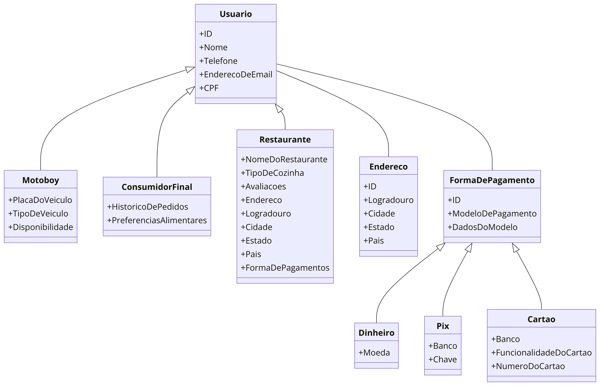
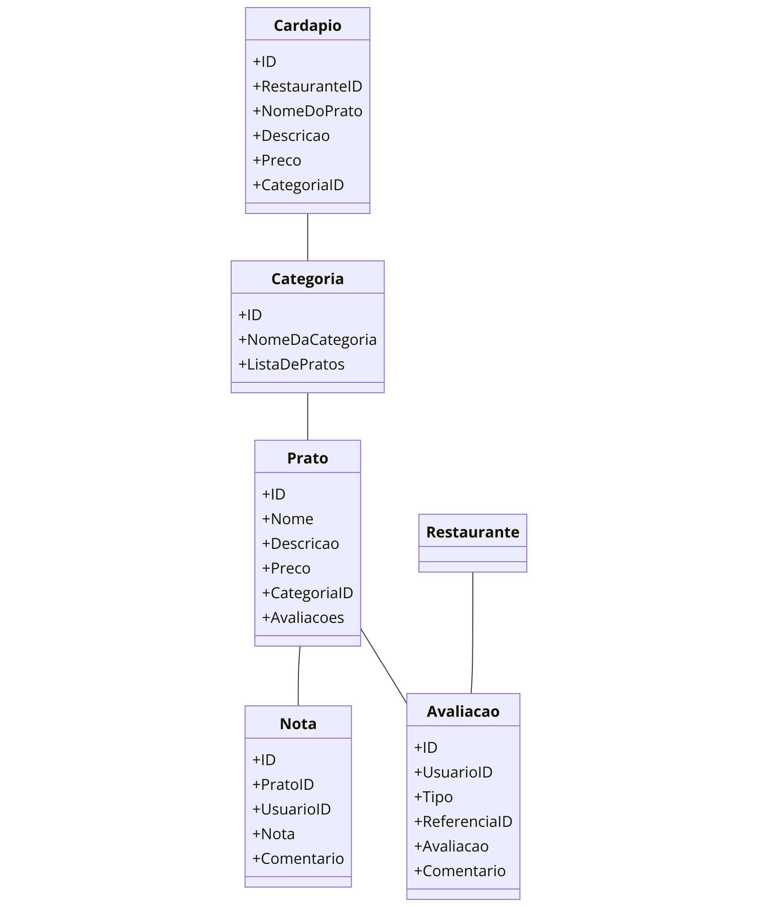

# Yummi Delivery App

## Descrição do Projeto

Yummi é um aplicativo de delivery de comida projetado para oferecer uma experiência fácil e rápida para usuários finais, restaurantes e motoboys. Este projeto de backend será construído utilizando Node.js com um banco de dados NoSQL (MongoDB).

## Tecnologias Utilizadas

- **Node.js**: Plataforma de desenvolvimento backend.
- **MongoDB**: Banco de dados NoSQL para armazenamento dos dados.
- **Express.js**: Framework para construir a API.
- **Mongoose**: Biblioteca ODM (Object Data Modeling) para MongoDB.

## Estrutura do Projeto

### Diagramas de Classes

#### Diagrama de Usuário e Subclasses


#### Diagrama de Cardápio e Relacionamentos


### Foco do Projeto Backend

1. **Gerenciamento de Usuários**:
   - **Usuário**: Dados básicos como nome, telefone, email e CPF.
   - **Motoboy**: Informações adicionais como placa do veículo, tipo de veículo e disponibilidade.
   - **ConsumidorFinal**: Histórico de pedidos e preferências alimentares.
   - **Restaurante**: Nome do restaurante, tipo de cozinha, avaliações e formas de pagamento.

2. **Endereços**:
   - Associados a usuários, armazenando logradouro, cidade, estado e país.

3. **Formas de Pagamento**:
   - Suporte para Dinheiro, Pix e Cartão com detalhes específicos para cada forma.

4. **Cardápio**:
   - **Categoria**: Tipos de pratos, como entradas, principais, sobremesas, etc.
   - **Prato**: Nome, descrição, preço e avaliações.
   - **Nota**: Avaliação do prato por parte dos usuários.

5. **Avaliações**:
   - Avaliações tanto para pratos quanto para restaurantes.

## Instruções de Uso

### Configuração do Ambiente

1. **Clone o repositório**
   ```bash
   git clone 
